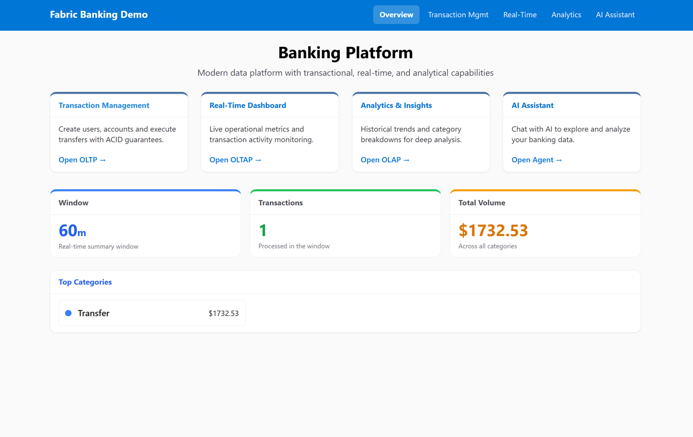
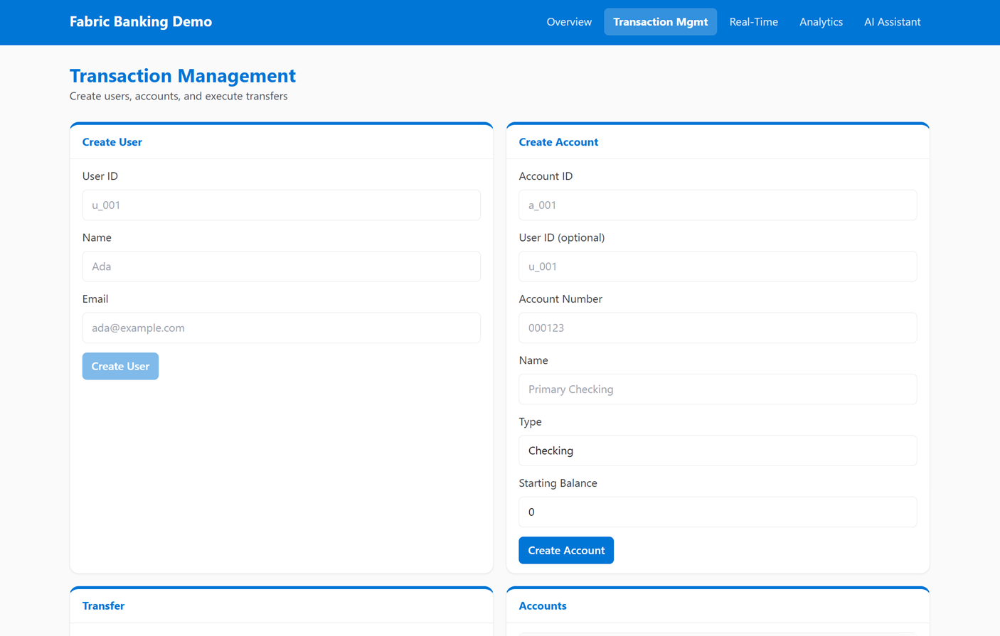
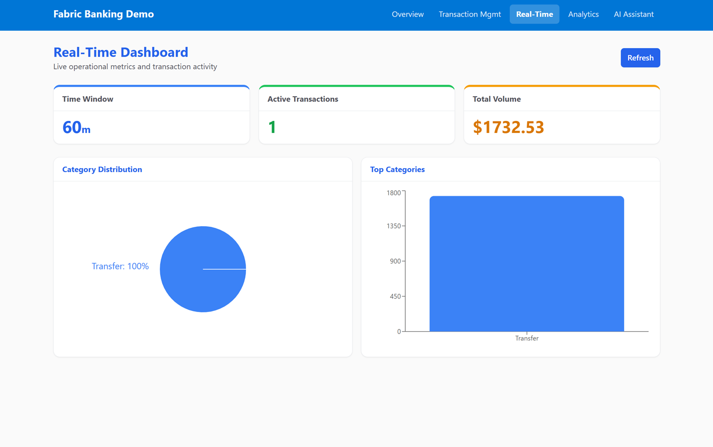
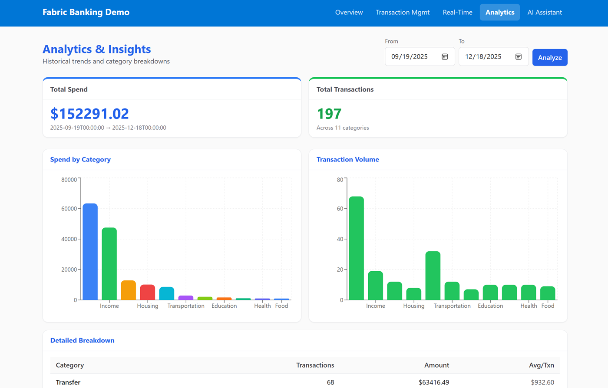
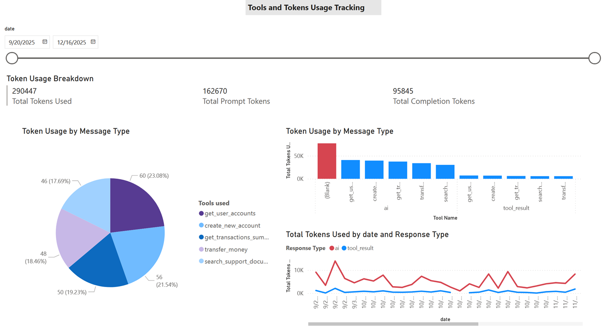
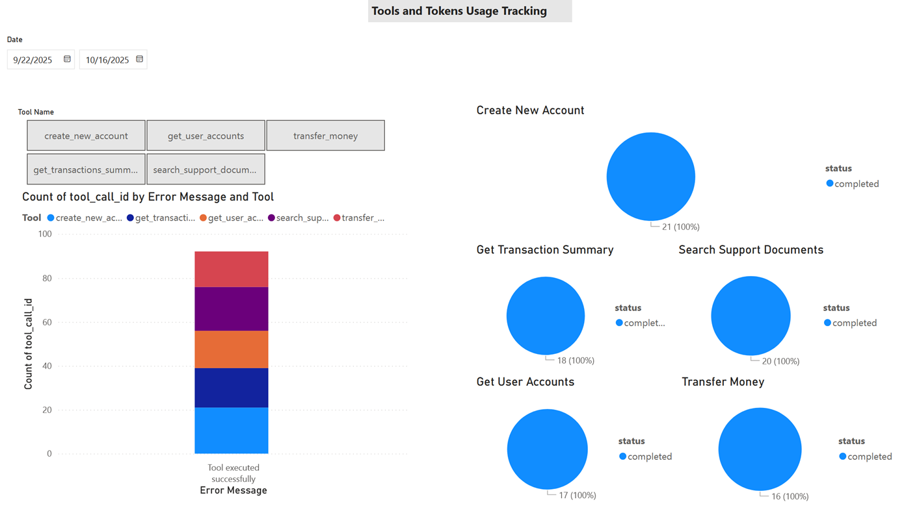
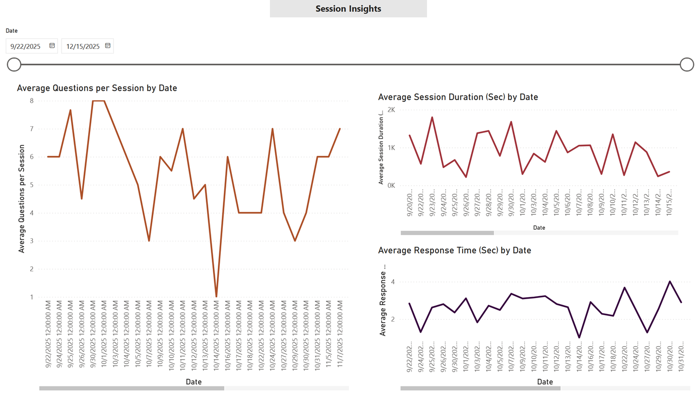
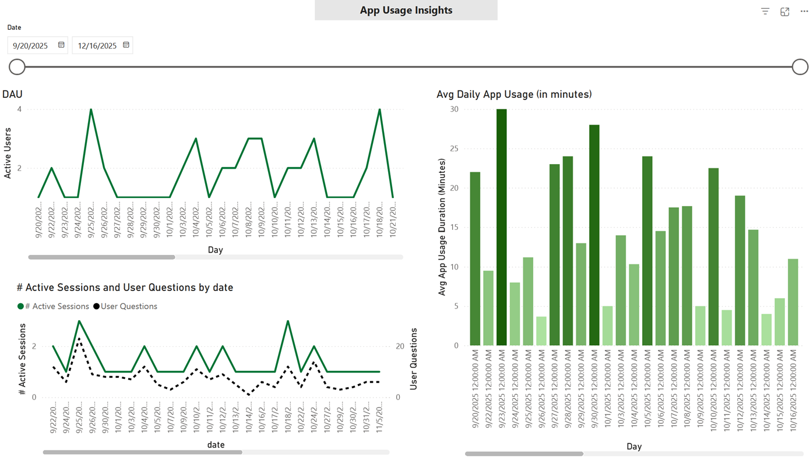

# 🌿Agentic Banking App with SQL in Fabric 

`Refactored` A lean full-stack demo showcasing **OLTP** (transactional), **OLAP** (near-real-time), and **OLAP** (historical) patterns using **Microsoft Fabric SQL**.

## Overview
- Refactored and simplified version of [Agentic Banking App with SQL in Fabric](https://github.com/Azure-Samples/sql-agentic-app-with-fabric).
- Removed LangChain, Flask, RAG features, and Fabric Agent (commercial capacity required).
- Focuses on core SQL patterns with simplified UI, data models, and Fabric artifacts.

## Architecture
- **Frontend:** Next.js 16, React 18, TypeScript, Tailwind CSS
- **Backend:** FastAPI, Python, SQLAlchemy (Access to Fabric SQL)
- **Database:** Microsoft Fabric SQL (users, accounts, transactions)

## Screenshots

- **Application**

| Overview | OLTP | OLAP | OLAP |
|-----|-----|-----|-----|
|  |  |  |  |

- **Power BI**

| Usage Tracking | Tool Health | Session Insights | App Usage |
|----------|----------|----------|----------|
|  |  |  |  |

---

## Setup

1. Set up a Microsoft Fabric workspace and deploy `artifacts (fabric_artifacts directory)` to Fabric workspace via GitHub integration.
2. Update the SQL connection string in the TMDL semantic model.
3. Create `views (create_view.sql in backend directory)` in the Fabric SQL database. 
4. Set the Fabric SQL connection string and set it in `.env (see the sample in backend)`.
5. Run demo data scripts to populate OLTP, OLAP, and reporting data.
6. Run the application locally.
7. See Power BI report named `Agent_Insights` in Fabric workspace 

## Setup Details

### 1. Setup in Fabric

- Upload `fabric_artifacts` to your Azure DevOps or GitHub repository.
- Enable a Microsoft Fabric account ([free 60-day trial](https://learn.microsoft.com/en-us/fabric/fundamentals/fabric-trial)).
- Create a new Fabric workspace.
- In **Workspace settings → [Git integration](https://learn.microsoft.com/en-us/fabric/cicd/git-integration/intro-to-git-integration)**, connect your repo and click **Connect and Sync**.
- Re-deploy the semantic model:
  1. Copy the **SQL connection string** from the SQL analytics endpoint settings.
  2. Copy the **Lakehouse analytics GUID** from the Fabric URL. **Lakehouse analytics GUID**: Copy the second GUID from the Fabric URL  
  (e.g. `https://app.fabric.microsoft.com/groups/<group-id>/lakehouses/<lakehouse-id>?experience=fabric-developer`)
  3. Update these values in `Fabric_artifacts/agentic_semantic_model.SemanticModel/definition/expressions.tmdl`, commit, and push.
  4. Trigger a **Source Control** update in Fabric and wait for completion.

### 2. Accessing Fabric SQL

- See `backend/.env.sample` for configuration.
- **FABRIC_SQL_CONNECTION_STRING**: SQL connection string for both application operational data (e.g., chat history) and sample banking data (Get this in your SQL database in Fabric → Settings → Connection strings → ODBC).
- Local development: `ActiveDirectoryInteractive`.
- Automation: service principal.
- Requires **ODBC Driver 18 for SQL Server**.

### 3. Sample Data & Views
- **OLTP / OLAP:** `backend/demo_data.py`
- **Chat & Power BI data:** `backend/demo_chat_data.py`
- **Reporting views:** `backend/create_view.sql`

### 4. Installation

#### Backend

```bash
cd backend
uv sync
```

#### Frontend

```bash
cd frontend
npm install
```

### 5. Running

#### Backend

```bash
cd backend
python -m uvicorn app.main:app --reload --port 8000
# or
python main.py
```

#### Frontend

```bash
cd frontend
npm run dev
```

### 6. Power BI Report

Open the Power BI report `Agent_Insights` from the Fabric workspace.

## Key Endpoints

- **OLTP:** `POST /oltp/users`, `POST /oltp/accounts`, `POST /oltp/transfer`
- **OLAP:** `GET /oltap/summary`, `GET /oltap/dashboard`
- **OLAP:** `GET /olap/spend`, `GET /olap/analytics`, `GET /olap/category-trends`
- **Health:** `GET /health`

## Fabric Assets

- **Power BI report:** `fabric_asset/artifacts/Agent_Insights.Report`
- **Semantic model:** `fabric_asset/artifacts/agentic_semantic_model.SemanticModel`
- **Demo application:** this repository (frontend + backend)

## References

- [Microsoft Fabric Documentation](https://learn.microsoft.com/en-us/fabric/)
- [Integrate SQL database in Microsoft Fabric](https://learn.microsoft.com/en-us/azure/service-connector/how-to-integrate-fabric-sql)
